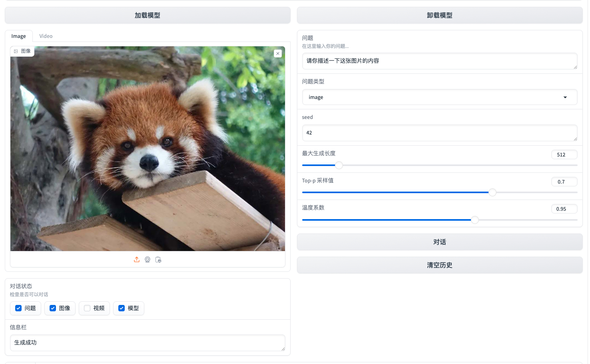
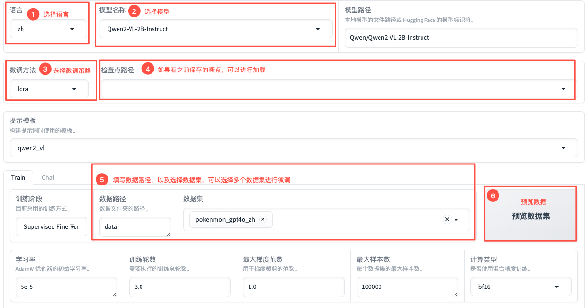
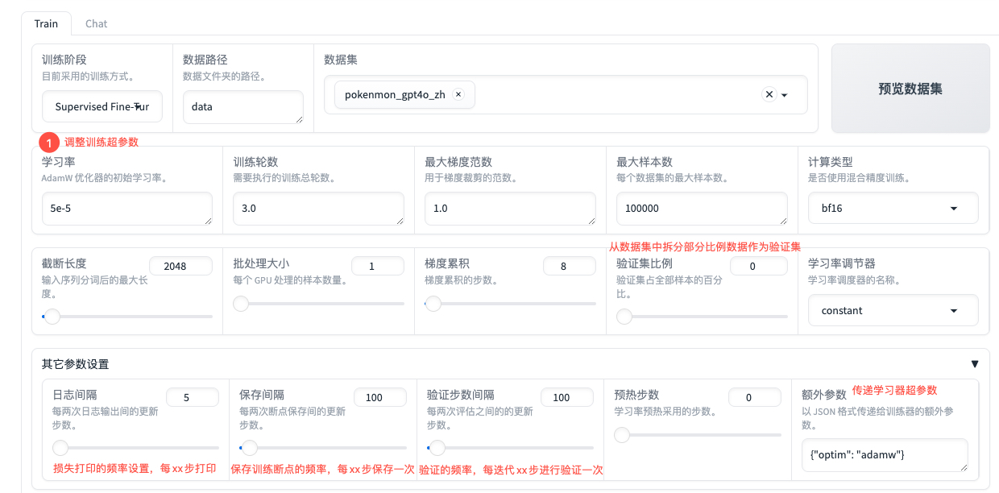
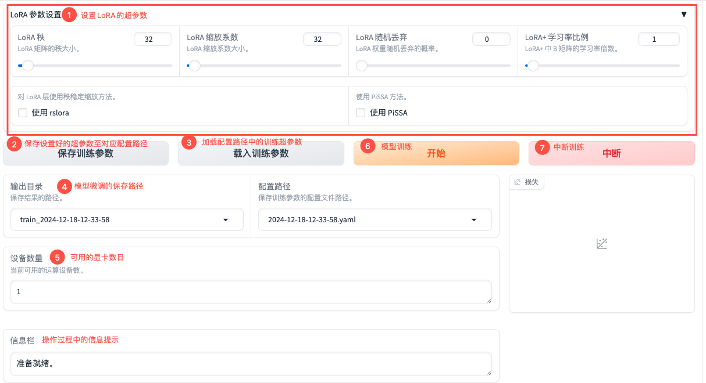
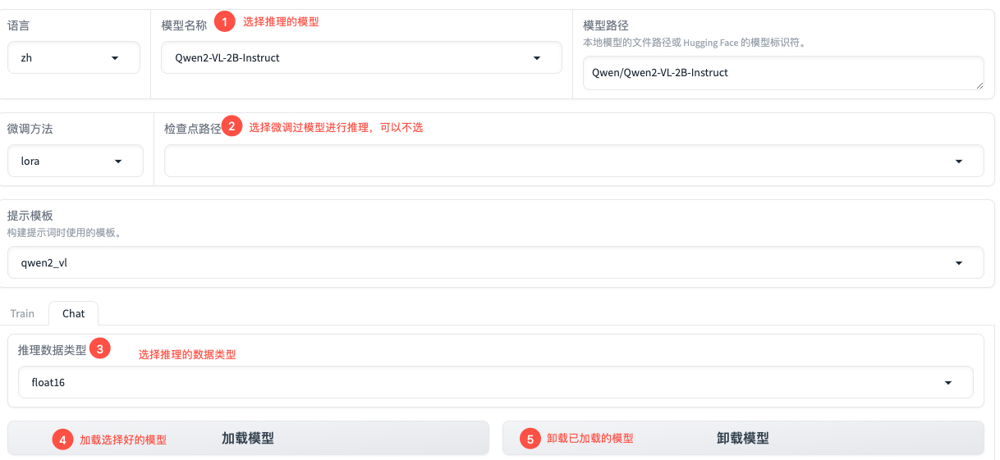
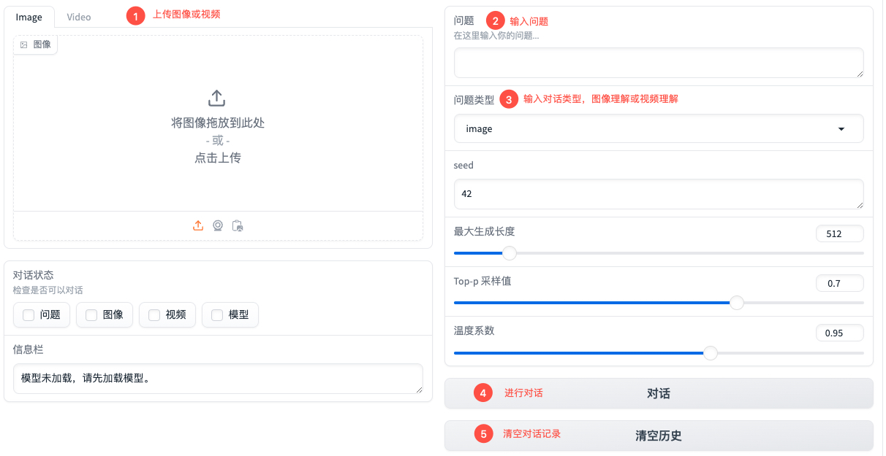
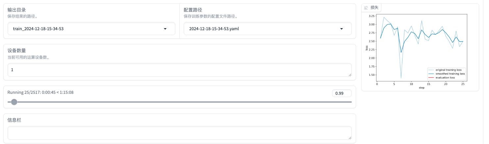
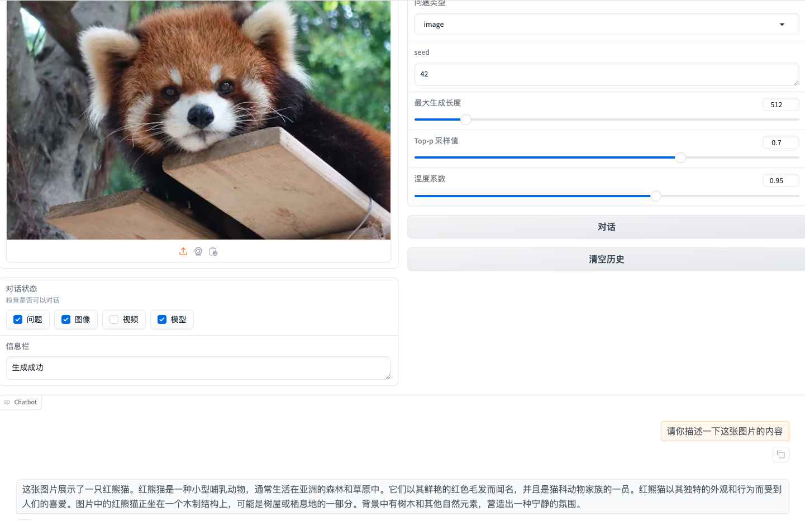

# PaddleMIX WebUI

## 1. 简介
PaddleMIX WebUI 是一个基于PaddleMIX套件的交互式平台，主要支持多模态理解任务的模型微调与推理功能。PaddleMIX WebUI 提供了丰富的可视化操作界面，支持用户进行模型微调、推理等操作。

## 2. 安装
* 安装Paddle和PaddleMIX依赖

* 安装PaddleMIX WebUI依赖
```
pip install -r paddlemix/webui/requirements.txt
```

## 3. 快速使用

### 3.1 启动
```
CUDA_VISIBLE_DEVICES=0 \
GRADIO_SHARE=1 \
GRADIO_SERVER_NAME=0.0.0.0 \
GRADIO_ANALYTICS_ENABLED=0 \
GRADIO_SERVER_PORT=8260 python paddlemix/webui/run_web.py
```
### 3.2 使用教程
#### 3.2.1 新增数据集

* 下载 [Pokemon](https://huggingface.co/datasets/llamafactory/pokemon-gpt4o-captions/tree/main) 数据集。

* 放置中文数据集文件到 `./data/pokemon_gpt4o_zh/pokemon_gpt4o_zh.parquet`

* 运行转换数据集脚本
```
python paddlemix/webui/scripts/convert_dataset.py \
    --data_dir ./data \
    --dataset_dir pokemon_gpt4o_zh \
    --file_name ./data/pokemon_gpt4o_zh/pokemon_gpt4o_zh.parquet
```

#### 3.2.2 模型微调
1) 模型选择




2) 超参数设置



3）LoRA参数设置与模型训练


#### 3.2.3 模型推理

1) 模型加载



2) 多模态理解


## 4. 使用展示


1） 模型微调



2） 模型推理


## 参考文献

```BibTeX
@inproceedings{zheng2024llamafactory,
  title={LlamaFactory: Unified Efficient Fine-Tuning of 100+ Language Models},
  author={Yaowei Zheng and Richong Zhang and Junhao Zhang and Yanhan Ye and Zheyan Luo and Zhangchi Feng and Yongqiang Ma},
  booktitle={Proceedings of the 62nd Annual Meeting of the Association for Computational Linguistics (Volume 3: System Demonstrations)},
  address={Bangkok, Thailand},
  publisher={Association for Computational Linguistics},
  year={2024},
  url={http://arxiv.org/abs/2403.13372}
}
```
